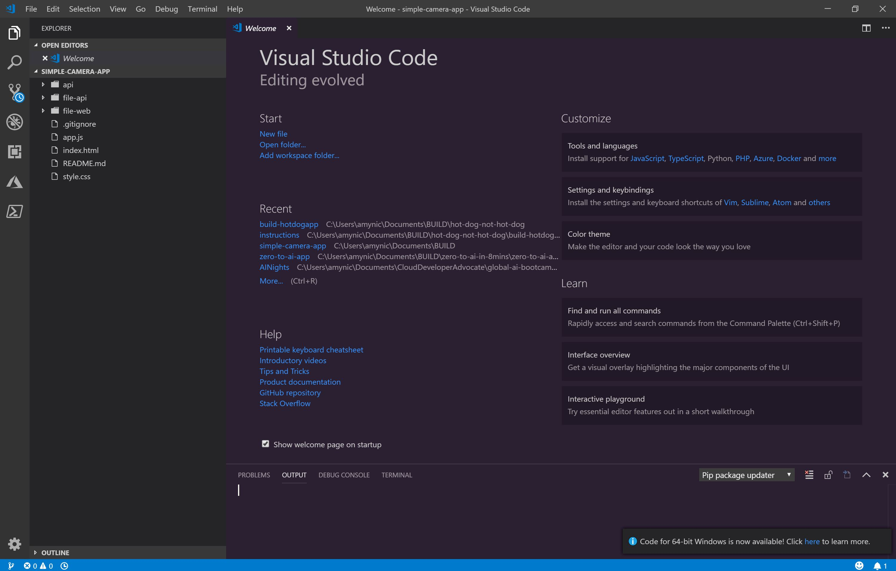
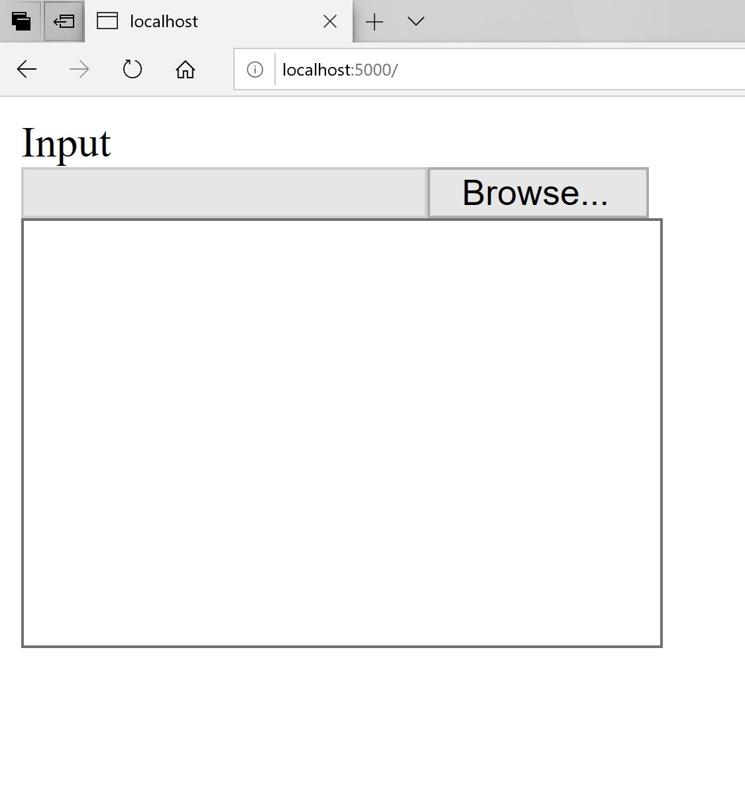
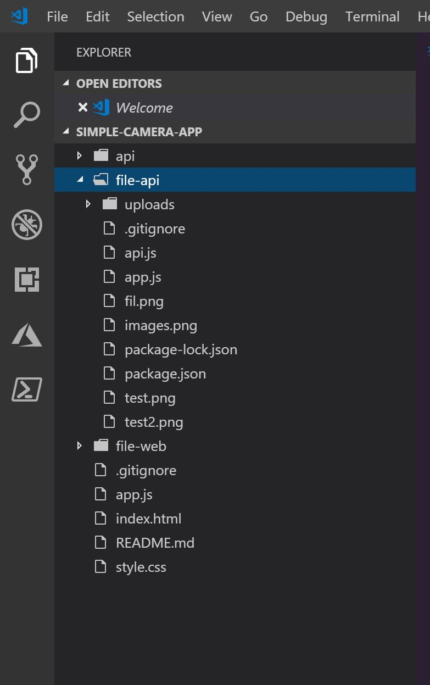
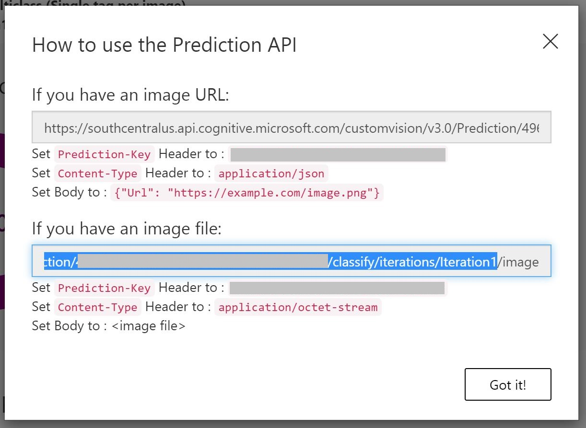
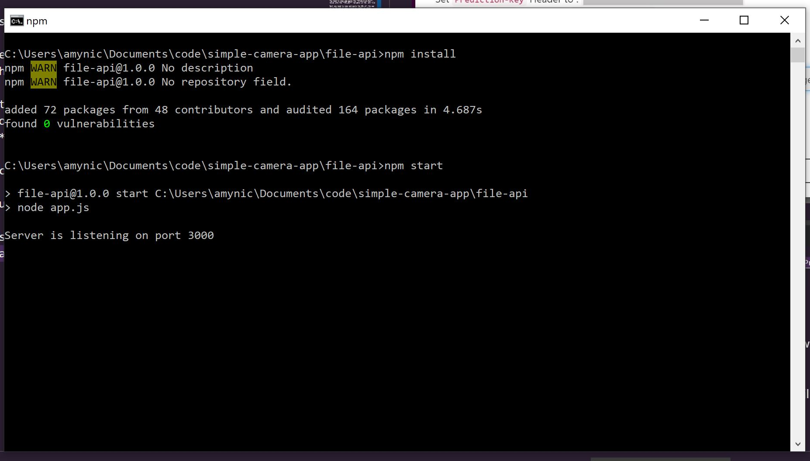
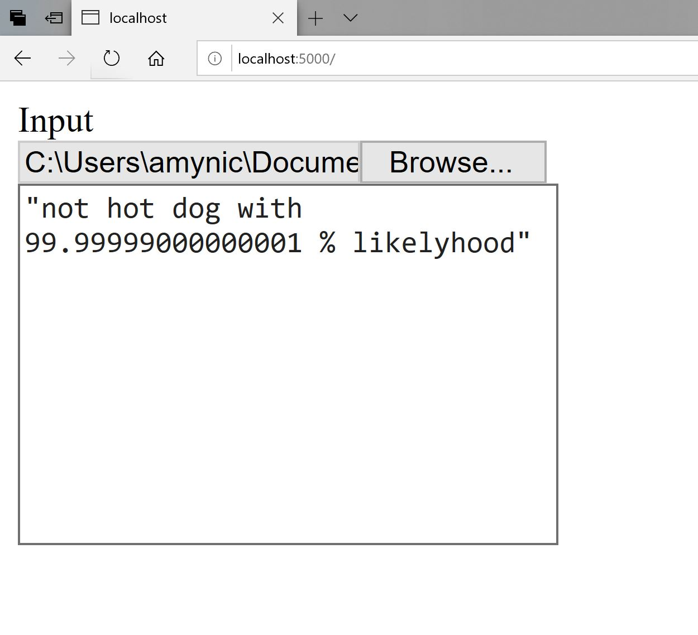

# **[Advanced]** Build your Hot Dog Classifier into an Application

In this advanced task you can build your [Azure Custom Vision](https://docs.microsoft.com/en-us/azure/cognitive-services/custom-vision-service/getting-started-build-a-classifier) image classifier into a simple web application.

You will need to install:
* [Visual Studio Code](https://code.visualstudio.com/Download)
* [Node.js](https://nodejs.org/en/)

## Download Application Code

Browse to a [simple-camera-app github account](https://github.com/amynic/simple-camera-app.git) and download the contents to you machine

Open the folder containing the code you just downloaded.



## Run Application Code

Open a command window. You can type **cmd** into the windows start menu.

navigate in the command window to your code folder. **cd foldername** will move you into a folder. **dir** will list all the contents of the folder.


Next we need to install a web server. type the command below and hit the return/enter key on your keyboard

```
npm install http-server -g
```

### Run front-end of the application (website user interface)

navigate to the **file-web** folder using the **cd** command. Then run the command below
```
http-server -p 5000
```


Once running you can open a web browser and navigate to [http://localhost:5000](http://localhost:5000) the user interface should look like below:



## Run back-end of the application (calls the machine learning API)

Now we need to get the back-end of the application running.

In Visual Studio Code - find the **file-api** folder and right click the folder, then choose **New File**. Enter the name for the new file - it is **.env**. This will open in a new window and be an empty file



Add the code below to the file:

```
API_KEY = 'enter api key'
URL = 'end prediction url'
```


Now you need to collect the api key and prediction URL information from the Azure Custom Vision service.

Navigate to [http://customvision.ai](http://customvision.ai) and log in. Find your hot dog application.

Once open click on the **Performance** tab and find the iteration you trained. Click the publish button and keep the default iteration name e.g. **Iteration1**

Now choose the **Prediction URL** button.

You need to copy and paste the **Prediction-Key** value into the **API_KEY** variable in the .env file

Next you need to copy and paste the URL all the way up to the end of your iteration number as shown below. Do not include the image/url word on the end. This value goes into the **URL** variable in the .env file




click save or CTRL + S

Now open another command window. You can type **cmd** into the windows start menu.

navigate in the command window to your code folder. **cd foldername** will move you into a folder. **dir** will list all the contents of the folder.

and **cd** into the **file-api** folder

then run the commands below:
```
npm install
npm start
```



## Upload a file and evaluate

Now both parts of the app are running. Refresh the local host front end in the web browser. Then click the browse button and upload a .png file of food to test.

The response should tell you which class it thinks the image is and also the confidence probability *(the closer to 100% the more confident its correct)*




